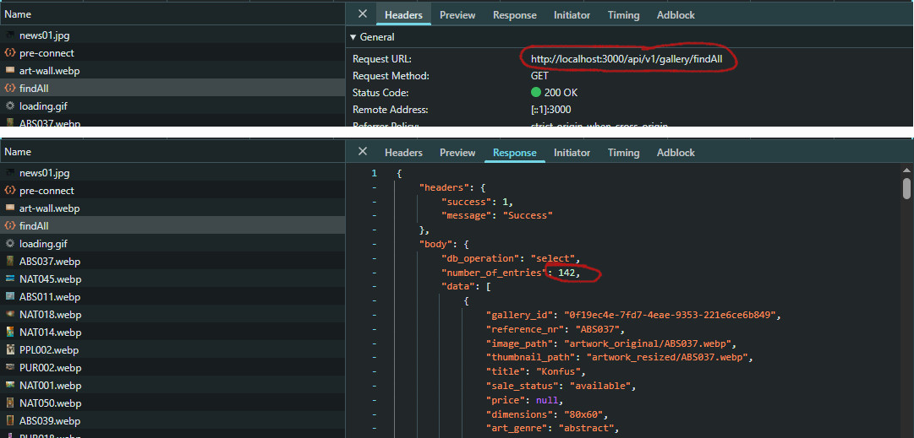
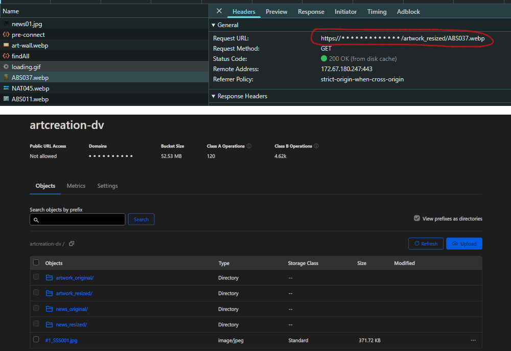
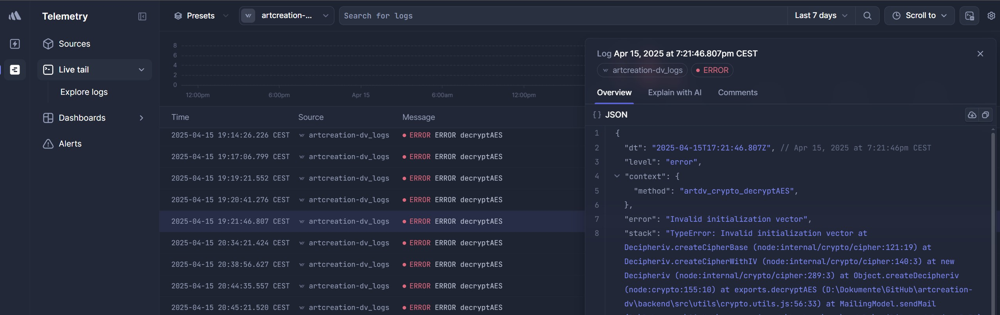

# yqni13 | artcreation-dv
$\texttt{\color{teal}{v1.2.1}}$


<br><br>

<div>
      
</div>

### Technology

<div style="display:flex; align-items:center;">    
      &nbsp;&nbsp;&nbsp;
      &nbsp;&nbsp;&nbsp;
      &nbsp;&nbsp;&nbsp;
      &nbsp;&nbsp;&nbsp;
      &nbsp;&nbsp;&nbsp;
      &nbsp;&nbsp;&nbsp;
      &nbsp;&nbsp;&nbsp;
      &nbsp;&nbsp;&nbsp;
      &nbsp;&nbsp;&nbsp;
      &nbsp;&nbsp;&nbsp;
      &nbsp;&nbsp;&nbsp;
</div>
<br>

### visit the <a href="https://artcreation-dv.at">WEBSITE</a>

<br>

## How to:

### Start

Create necessary modules (/frontend and /backend):
```sh
$ npm install
```

Fill env variables for Frontend/Backend with the necessary data/paths and run:
```sh
$ npm run start
```
to autofill environment file with env data and to start on local dev server. Navigate to `http://localhost:4200/`. The application will automatically reload if you change any of the source files.<br>
To activate the backend (to use email service for the contact form) run command to start on selected port (default 3000):
```sh
$ node server.js
```

### Build & Deploy
This project is currently hosted by 4 different hosting services. Frontend is hosted by <a href="https://app.netlify.com/">Netlify</a> and for the backend part <a href="https://vercel.com/">Vercel</a> is used to deploy and host serverless. Data and images are managed via PostgreSQL database on <a href="https://neon.tech">Neon</a> and cloud-storage (R2 Bucket) by <a href="https://cloudflare.com">Cloudflare</a>.

<br>

## Overview

### $\textsf{\color{teal}Features}$

<dl>
      <dd>:diamond_shape_with_a_dot_inside: Angular v19 standalone with routing + nested routes on id</dd>
      <dd>:turtle: Custom preload/lazy loading on viewport/scroll for gallery previews</dd>
      <dd>:clipboard: Custom form components (text-, textarea- & select-input)</dd>
      <dd>:newspaper: Custom carousel component</dd>
      <dd>:new_moon_with_face:/:sun_with_face: Custom color theme (dark/light mode)</dd>
      <dd>:wrench: Custom validation + service & pipes</dd>
      <dd>:e-mail: Mail service with node.js & nodemailer for Backend</dd>
      <dd>:signal_strength: custom interception + custom snackbar modal</dd>
      <dd>:globe_with_meridians: i18n (internationalization) - translate de/en</dd>
      <dd>:floppy_disk: PostgreSQL database + cloud-storage to manage data & images</dd>
      <dd>:iphone: Responsive design 400px > width < 1800px via flexbox & media queries</dd>
</dl>

<br>

### $\textsf{\color{teal}Customized form}$

To contact the artist for product orders or general inquiries, a custom form is provided. Currently, this feature is not available in the live version due to the lack of backend hosting.
<br><br>
The form combines customized components, frontend/backend validation logic, `nodemailer`, and a Node.js service to send emails via a predefined no-reply account.

Validation checks ensure all required fields are filled, that the reference number follows the correct format, and that a valid selection has been made.<br>Figure 2 shows an example validation message:
`"ReferenceNr '561H65' does not exist"`.


<div align="center">
      
      Figure 2
</div>

<br>

### $\textsf{\color{teal}Internationalization}$

To reach an international audience of artists and art enthusiasts, the webpage was initially developed in English, with support for multiple languages implemented using `@ngx-translate/core` and `@ngx-translate/http-loader`.
<br><br>
Currently, two languages are available: English and German (see Figure 3).
<br><br>
Static and dynamic texts are translated based on the selection made in the footer. The selected language is saved in `localStorage`, similar to the color theme, and persists between visits.
<br><br>
To simplify translation maintenance, the `TranslateHttpLoader` was customized to combine multiple `.json` files per language instead of the default single-file approach.
<br><br>
See [custom translate loader](frontend/public/assets/i18n/custom-translate-loader.ts) for implementation details.

<div align="center">
      
      Figure 3, v1.0.0-beta.4
</div>

<br>

### $\textsf{\color{teal}Customized snackbar / interceptor}$

In case of unexpected responses or to visually confirm actions, a custom snackbar appears at the top right (or centered on screens smaller than 500px). The snackbar can be triggered with just two required inputs (title + type), and optionally extended with up to five configuration parameters.
<br><br>
To enhance contrast, each of the four message types use a distinct color: $\textsf{\color{red}{error}}$, $\textsf{\color{royalblue}{info}}$, $\textsf{\color{green}{success}}$, $\textsf{\color{orange}{warning}}$.

Figure 4 shows an example error message indicating that the email could not be sent (highlighted in red), triggered by an HTTP interceptor when no backend is available.

<div align="center">
      
      Figure 4
</div>

<br>

### $\textsf{\color{teal}Customized lazy loading / preload}$

Instead of Angular’s built-in `@defer` blocks, this application uses a custom lazy loading strategy via `HostListeners`.

When opening the Gallery component, all images currently within the viewport are rendered immediately. Additionally, a buffer of images just below the viewport is preloaded to ensure a smooth scrolling experience. As the user scrolls, more images are continuously preloaded.
<br><br>
Figure 5 illustrates how 6 images inside the viewport, along with the next 3 rows of images, are shown as preloaded in the network tab of DevTools.

<div align="center">
      
      Figure 5, v1.0.0-beta.3
</div>

<br>

### $\textsf{\color{teal}Theme settings}$

The webpage offeres two theme settings: $\textsf{\color{gray}{dark mode}}$ & $\textsf{\color{goldenrod}{light mode}}$. The information on the active setting is stored in the localstorage with dark mode as default setting at the beginning.

<div align="center">
      
      &nbsp;&nbsp;&nbsp;&nbsp;&nbsp;&nbsp;&nbsp;&nbsp;&nbsp;&nbsp;&nbsp;&nbsp;
      
      Figure 6
</div>

<br>

### $\textsf{\color{teal}Reactive images}$

Most images are linked with additional logic for either displaying more details or scaling up. In the news archive, text content is shown, and clicking the magnifier icon displays the image in full resolution.
<br><br>
In the gallery section, preview thumbnails open in a museum-style view, showing all available details about the artwork. Clicking the image again displays it at maximum resolution (see Figure 7).

<div align="center">
      
      Figure 7
</div>

<br>

### $\textsf{\color{teal}Database layer}$

PostgreSQL is used as the relational database management system to store all necessary data. The free-tier plan from the Neon hosting service is sufficient for handling all data in this context (see Figure 8, basic findAll request).<br>Migrations are handled with the node package `node-pg-migrate` in the backend (see [help docs](/backend/src/db/migration.md)).
<br><br>
Image files for "gallery" and "news" elements are not stored in the database; only their paths are saved within the respective entries (see Figure 8, response). Additionally, file input from users (for "gallery" or "news" items) is processed (regarding format and size) and uploaded to a cloud object storage - in this case, an R2 Bucket from `Cloudflare`.
<br><br>
Once data is retrieved from the database, the saved image path is concatenated with a cloud-specific access URL to form the full image URL (see Figure 9, red highlight). The images are then loaded from the cloud or cache.

<div align="center">
      
      Figure 8, v1.0.0-beta.13
</div>

<br>

<div align="center">
      
      Figure 9, v1.0.0-beta.13
</div>

<br>

### $\textsf{\color{teal}Logging}$

For the UI currently only console logs and snackbar modals inform about errors and warnings. But for the backend layers, the logging framework `Winston` is used in combination with Logtail from `BetterStack` to have easy access and long-term storage (see Figure 10, test phase).

<div align="center">
      
      Figure 10, v1.0.2
</div>


<br>

### $\textsf{\color{teal}Administration}$

Data related to the "gallery" and "news" elements can be managed by the administrator via login and a dedicated administration area. While "gallery" data is accessible through the "gallery" section in the navigation bar, "news" items are displayed on the start page and in the archive. On the start page, the latest three "news" entries are presented using a carousel component.
<br><br>
The archive lists all "news" entries in descending chronological order. Features such as text-based search and sorting will be available in a later version.<br>

The application supports single-file uploads (maximum 10MB) from the user’s local device to associate an image with a newly created item. Alternatively, a "news" item can be linked to an existing "gallery" entry (see Figure 11: select an existing artwork). Using a foreign key referencing the linked "gallery" item's ID, a `LEFT JOIN` SQL query is used to retrieve the necessary and up-to-date data.
```sh
SELECT
  ${tableNews}.*,
  ${tableGallery}.image_path AS image_path_${tableGallery},
  ${tableGallery}.thumbnail_path AS thumbnail_path_${tableGallery},
  ${tableGallery}.reference_nr AS reference_nr_${tableGallery},
  ${tableGallery}.art_genre AS art_genre_${tableGallery}
FROM ${tableNews}
LEFT JOIN ${tableGallery} ON ${tableNews}.gallery = ${tableGallery}.gallery_id
ORDER BY ${orderPrio1} DESC
```
The provided image paths allow images to be loaded without additional database queries. The reference number and art genre offer sufficient information to navigate directly from a news article to the corresponding artwork details (see Figure 11).

<div align="center">
      
      Figure 11, v1.1.0
</div>

<br><br>

## Testing


### Cross-browser testing

 |  |  |  |  | 
|:------:|:------:|:------:|:------:|:------:|:------:|
|Firefox | Chrome | Opera  | Edge   | DuckGo | Brave  |
|Yes*    | Yes    | Yes    | Yes    | Yes    | Yes    |


<br>

*This browser has problems with some functionality.

<br>

### Angular ESLint

Added angular-eslint to project for next step of testing.<br>
Install ESLint global via node package manager: 
```sh 
$ npm install -g eslint
```
Install ESLint local for angular project: 

```sh
$ ng add @angular-eslint/schematics
```

Run ESLint to list all current lint errors: 
```sh
$ npm run lint
```
<br>


## Updates
[list of all updates](update_protocol.md)

### $\textsf{last\ update\ 1.1.1\ >>\ {\color{pink}1.2.1}}$

- $\textsf{\color{green}Change:}$ Added new service "assets" to handle media data by admin. Home page will display art exhibition images in carousel underneath news slider.
- $\textsf{\color{red}Bugfix:}$ Hovering/scrolling in mobile mode does not change arrangement of artworks in gallery overview. [Before: Hovering/scrolling in mobile mode on certain viewport (artworks close to sides) changed total width of row and dropped one element into next row => every row x elements and in row of hovered element x - 1.]

<br>

### Aimed objectives for next $\textsf{\color{green}minor}$ update:
<dl>
      <dd>- pagination in archive component</dd>
      <dd>- provide security standards: input sanitizations, content security policies & HttpOnly cookies</dd>
      <dd>- deploy a Web Application Manifest to make webpage into a progressive web app (PWA)</dd>
</dl>
<br>

### Aimed objectives for next $\textsf{\color{cyan}major}$ update:
<dl>
      <dd>- direct pay option</dd>
</dl>
<br>
