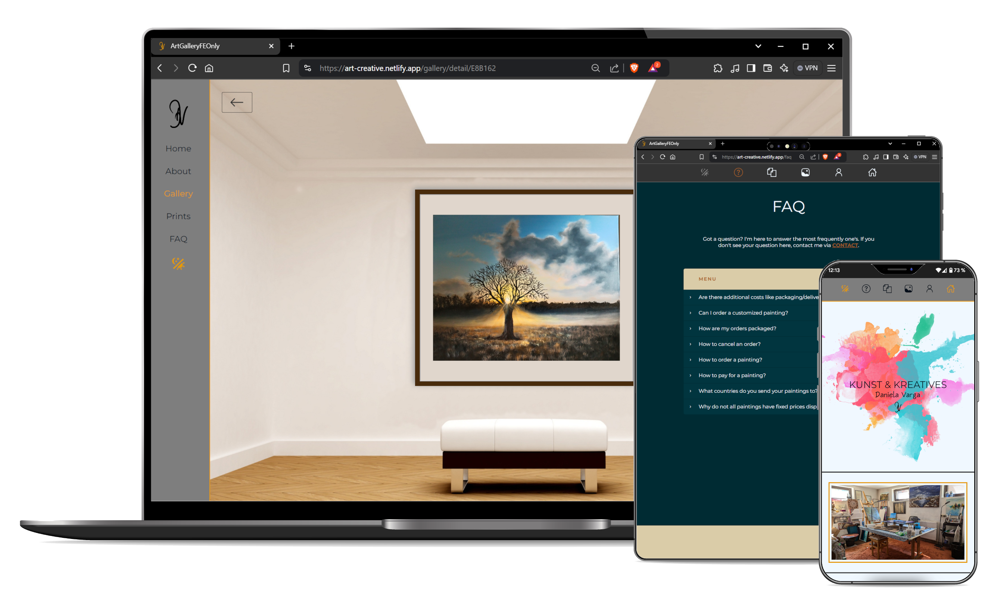

# yqni13 artcreation-dv
$\texttt{\color{teal}{v1.0.0-beta.2}}$

  

      

### Technology

    
      
      
      &nbsp;&nbsp;
      &nbsp;&nbsp;
      &nbsp;&nbsp;
      

 

### <a href="https://artcreation-dv.netlify.app/">TRY LIVE DEMO</a> (currently without contact form functionality [NodeJS backend])

 

## How to:

### Start

Get startet with `npm install` to create necessary modules and run `ng serve` to start on local dev server. Navigate to `http://localhost:4200/`. The application will automatically reload if you change any of the source files. To activate the backend (to use email service for the contact form) run command `node server-custom.js` on port 3000.

### BUILD & DEPLOY
This project is currently hosted by Netlify <a href="https://app.netlify.com/">LINK</a> with the custom URL "https://artcreation-dv.netlify.app/" without backend functionality. Hosting is fully automated and only access to the repository is necessary to build the app and run deployment.

  

## Features

<dl>
      <dd>:diamond_shape_with_a_dot_inside: Angular v18 standalone with routing + nested routes on id</dd>
      <dd>:turtle: Lazy-loading on viewport/scroll for image resources</dd>
      <dd>:clipboard: Custom form components (text-, textarea- & select-input)</dd>
      <dd>:question: Custom faq component</dd>
      <dd>:newspaper: Custom carousel component</dd>
      <dd>:new_moon_with_face:/:sun_with_face: Custom color theme (dark/light mode)</dd>
      <dd>:wrench: Custom validation + service & pipes</dd>
      <dd>:e-mail: Mail service with node.js & nodemailer for Backend</dd>
      <dd>:signal_strength: Http interception + custom snackbar modal</dd>
      <dd>:closed_lock_with_key: Different protection layers for certain images (disabling right click; watermarks)</dd>
      <dd>:iphone: Responsive design 400px > width < 1800px via flexbox & media queries</dd>
</dl>

  

## Updates

[list of all updates](update_protocol.md)
### $\textsf{last\ update\ 1.0.0-beta.1\ >>\ {\color{pink}1.0.0-beta.2}}$

- $\textsf{\color{green}Change:}$ Scrollbar set to include only scrollable content (excluding navbar in mobile mode).
- $\textsf{\color{green}Change:}$ Added scroll-to-top button on right bottom corner.
- $\textsf{\color{red}Bugfix:}$ Wrapped nav elements keep center alignment. [Before: Navigation elements that are wrapped didn't have center alignment and were displayed aligned to the left side.]

 

### Aimed objectives for next $\textsf{\color{green}minor}$ update:
<dl>
      <dd>- rename project</dd>
      <dd>- change host to deploy working backend</dd>
      <dd>- improve LocalStorage handling</dd>
      <dd>- disable/enable sending button of contact form until response intercepted</dd>
      <dd>- selection of numbers of articles to order via contact form</dd>
      <dd>- real text content</dd>
      <dd>- correct email accounts to recieve and send in BE</dd>
      <dd>- key listeners</dd>
      <dd>- deploy a Web Application Manifest to make webpage into a progressive web app (PWA)</dd>
      <dd>- preload img fullscale in gallery details component</dd>
      <dd>- text search in archive component</dd>
</dl>
 

### Aimed objectives for next $\textsf{\color{cyan}major}$ update:
<dl>
      <dd>- translation option de/en</dd>
      <dd>- print component content + changes in logic for gallery details & contact</dd>
      <dd>- direct pay option</dd>
</dl>
 
