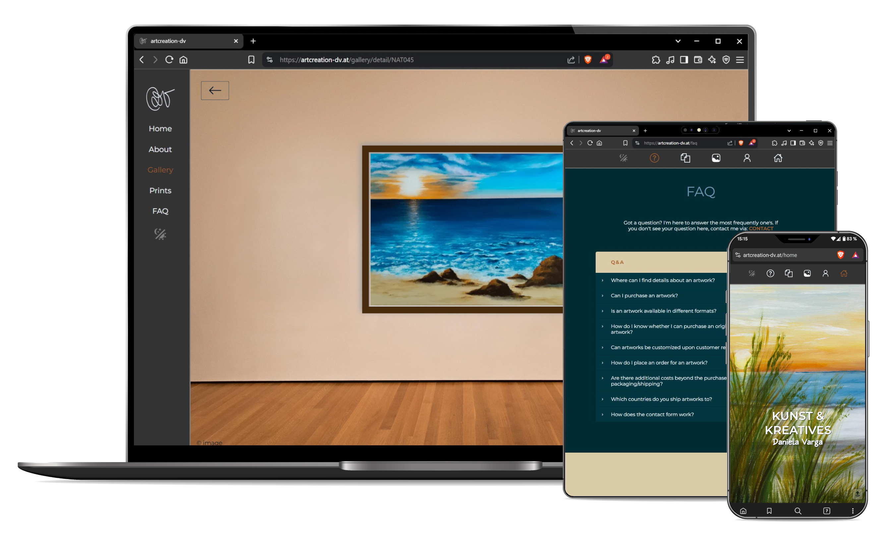
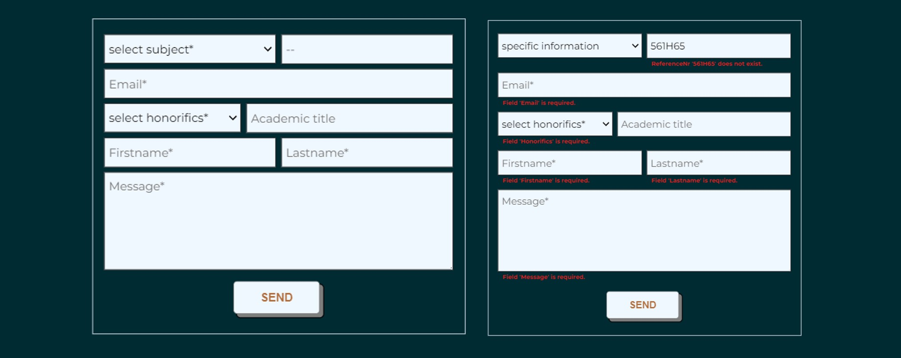
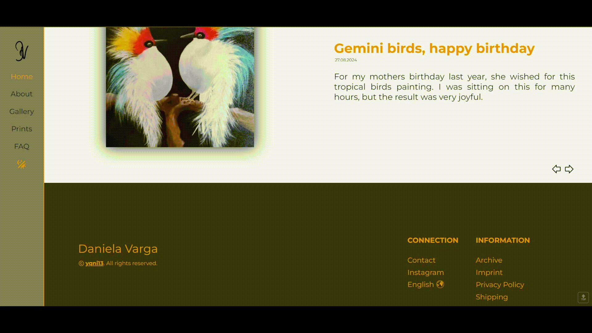
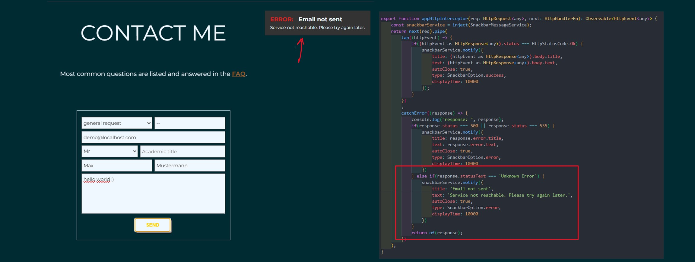
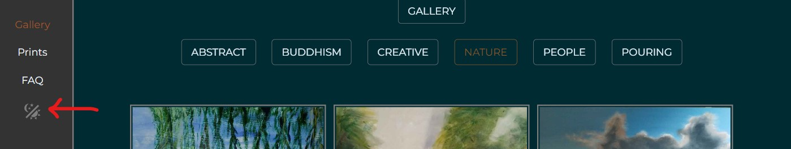
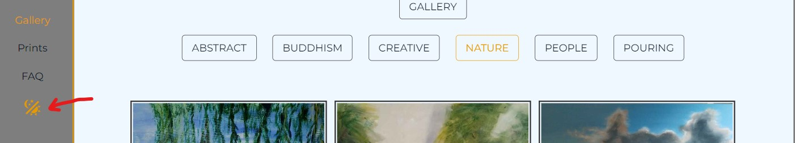

# yqni13 artcreation-dv
$\texttt{\color{teal}{v1.0.0-beta.10}}$

  

      

### Technology

    
      
      
      &nbsp;&nbsp;
      &nbsp;&nbsp;
      &nbsp;&nbsp;
      &nbsp;&nbsp;
      

 

### <a href="https://artcreation-dv.netlify.app/">TRY LIVE DEMO</a> (contact form sends request to your 'from' email for demo)

 

## How to:

### Start

Get startet with `npm install` to create necessary modules and run `ng serve` to start on local dev server. Navigate to `http://localhost:4200/`. The application will automatically reload if you change any of the source files. To activate the backend (to use email service for the contact form) run command `node server-custom.js` on port 3000.

### Build & Deploy
This project is currently hosted by 2 different hosting services. Frontend is hosted by <a href="https://app.netlify.com/">Netlify</a> and for the backend part <a href="https://vercel.com/">Vercel</a> is used to deploy and host. Both services require environment variables, which are provided in Angular as .js files and in NodeJS as .env files (the .env needs to be in root of backend): 
[frontend] 
var: API_BASE_URL, val: url/port you use for backend, default=https://localhost:3000 
[backend] 
var: SECRET_EMAIL_RECEIVER, val: receiver email 
var: SECRET_EMAIL_SENDER, val: sender email you need to setup yourself 
var: SECRET_EMAIL_PASS, val: sender email password for external use 

### Docker CMD

Docker-ready to create images and containers on different ways in *Powershell*: #1 manual for FE/BE 
[frontend] 
yourpath/artcreation-dv/frontend> $env:API_URL="http://localhost:3000" 
yourpath/artcreation-dv/frontend> `docker build -t artcreation-dv_frontend .` 
yourpath/artcreation-dv/frontend> `docker run --name artcreation-dv -p 4200:4200 frontend` 
[backend] 
yourpath/artcreation-dv/backend> `docker build -t artcreation-dv_backend .` 
yourpath/artcreation-dv/backend> `docker run --name artcreation-dv -it -p 3000:3000 backend` 
or #2 in one go via docker-compose.yaml 
yourpath/artcreation-dv> `docker compose up -d` 
Remove containers and images via command: 
`docker compose down --rmi=all`
  

## Overview

### $\textsf{\color{teal}Features}$

<dl>
      <dd>:diamond_shape_with_a_dot_inside: Angular v18 standalone with routing + nested routes on id</dd>
      <dd>:turtle: Custom preload/lazy loading on viewport/scroll for gallery previews</dd>
      <dd>:clipboard: Custom form components (text-, textarea- & select-input)</dd>
      <dd>:newspaper: Custom carousel component</dd>
      <dd>:new_moon_with_face:/:sun_with_face: Custom color theme (dark/light mode)</dd>
      <dd>:wrench: Custom validation + service & pipes</dd>
      <dd>:e-mail: Mail service with node.js & nodemailer for Backend</dd>
      <dd>:signal_strength: Http interception + custom snackbar modal</dd>
      <dd>:globe_with_meridians: i18n (internationalization) - translate to german or english</dd>
      <dd>:closed_lock_with_key: Different protection layers for certain images (disabling right click; watermarks)</dd>
      <dd>:iphone: Responsive design 400px > width < 1800px via flexbox & media queries</dd>
</dl>

 

### $\textsf{\color{teal}Customized form}$

For contacting the artist regarding ordering a product or other requests, there is a form to fill in which works currently not in live version due to missing backend hosting. The combination of customized form components, validation structure and logic (frontend/backend service, nodemailer & Node.js) sends an email via predefined no-reply account to the artist. Custom validation checks for required input, correct format of necessary reference number and valid selection (see figure 2; message "ReferenceNr '561H65' does not exist").

      
      Figure 2

 

### $\textsf{\color{teal}Internationalization}$

Due to the interest of artist and art fans around the globe, the webpage was developed primarily in english. Additionally, internationalization was implemented (via ngx-translate/core & /http-loader) and at this point 2 languages are available to select (see Figure 3). Dynamic and static texts can be displayed in english or german by choosing the regarding option in the footer. The value gets saved in the localstorage (same as the colour theme) and will stay translated in the selected language. To improve maintanence, the TranslateHttpLoader was customized to join multiple .json files for the same language translation rather than the usual way with only 1 file per language (see custom-translate-loader.ts). 

      
      Figure 3

 

### $\textsf{\color{teal}Customized snackbar / interceptor}$

In case of unexpected responses or to visually confirm actions, a customized snackbar will appear on the right upper side (or centered for mobile < 500px width). The snackbar can easily be constructed by 2 required inputs (title + type) or more advanced up to 5 input options. For better visual contrast, 4 types (error, info, success, warning) differ additionally in colors. Figure 4 shows an error message, that the email could not be sent (red highlighted) which is triggered by the response caught in the http-interceptor (case of no active backend).

      
      Figure 4

 

### $\textsf{\color{teal}Customized lazy loading / preload}$

Instead of using the predefined @defer blocks of Angular to provide lazy loading, this webpage uses a customized preload/lazy loading via HostListeners. Opening the "Gallery" component, all pictures inside the viewport will be rendered. Additionally, a certain number of images that are below the viewport get loaded in the same instance to provide a buffer of already rendered images when scrolling. HostListeners also keep preloading images when scrolling to optimize the user experience. Figure 5 shows the loading of the displaying 6 images inside the viewport + the next 3 rows of pre-rendered images in the network tab of DevTools.

      
      Figure 5

 

### $\textsf{\color{teal}Theme settings}$

The webpage offeres two theme settings: $\textsf{\color{gray}{dark mode}}$ & $\textsf{\color{goldenrod}{light mode}}$. The information on the active setting is stored in the localstorage with dark mode as default setting at the beginning.

      
      &nbsp;&nbsp;&nbsp;&nbsp;&nbsp;&nbsp;&nbsp;&nbsp;&nbsp;&nbsp;&nbsp;&nbsp;
      
      Figure 6

 

### $\textsf{\color{teal}Reactive images}$

Most of the images are linked with logic to either displaying more details or scaling up. In the archive, regarding news, text is displayed and click on the magnifier shows the image in max display resolution. The previews in the gallery open up the museums-view and all the details regarding the artwork. Another click on the picture also displays in max display resolution (see figure 7).

      
      Figure 7

  

## Updates
[list of all updates](update_protocol.md)

### $\textsf{last\ update\ 1.0.0-beta.9\ >>\ {\color{pink}1.0.0-beta.10}}$

- $\textsf{\color{red}Bugfix:}$ Contact form displays all fields as expected before and after usage. [Before: After sending a request, the form would not display the fields 'price' and 'type' => specific reset was necessary.]
- $\textsf{\color{green}Change:}$ Removed scrollbar from 'gallery' page.
- $\textsf{\color{red}Bugfix:}$ Scroll-to-top works again as expected. [Before: Element 'scrollAnchor' got value assigned inside constructor which now leads to null and can't scroll to top => assign value inside ngOnInit lifecycle instead.]
- $\textsf{\color{red}Bugfix:}$ Sending an general request mail works as expected. [Before: Mail form was invalid for subject 'general request', because field 'type' was invalid due to no chosen reference-number and missing value of 'type' => validator gets removed in case of subject 'general request'.]

 

### Aimed objectives for next $\textsf{\color{green}minor}$ update:
<dl>
      <dd>- selection of numbers of articles to order via contact form</dd>
      <dd>- real text content</dd>
      <dd>- correct email accounts to recieve and send in BE</dd>
      <dd>- text search in archive component</dd>
      <dd>- provide security standards: input sanitizations, content security policies & HttpOnly cookies</dd>
      <dd>- deploy a Web Application Manifest to make webpage into a progressive web app (PWA)</dd>
      <dd>- custom 404 error page</dd>
      <dd>- 'print' component content + changes in logic for gallery details & contact</dd>
</dl>
 

### Aimed objectives for next $\textsf{\color{cyan}major}$ update:
<dl>
      <dd>- direct pay option</dd>
      <dd>- admin interaction logic</dd>
</dl>
 
