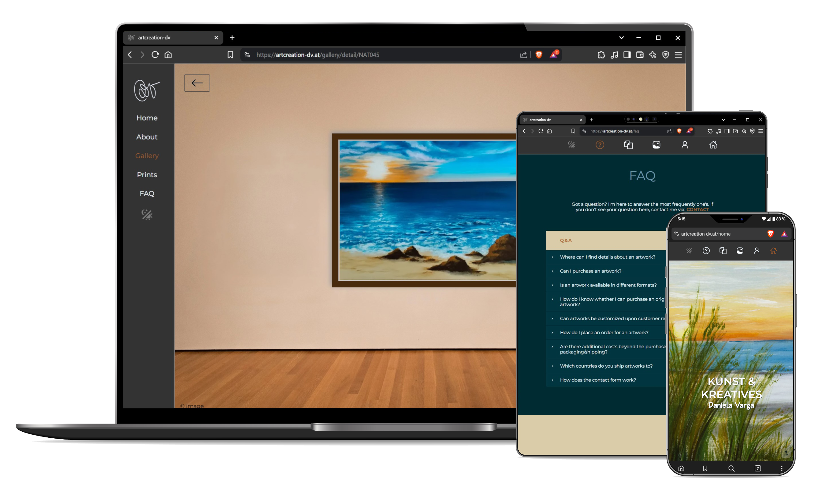
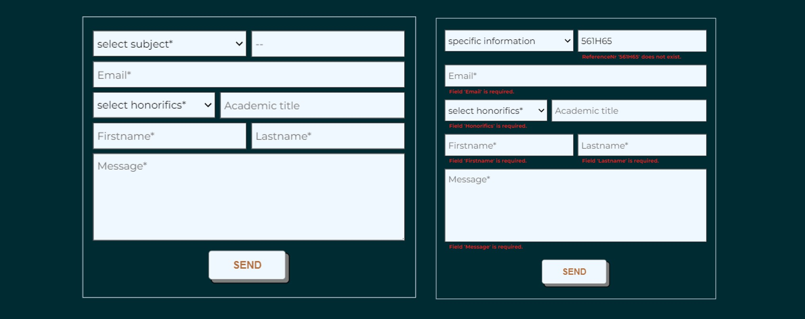
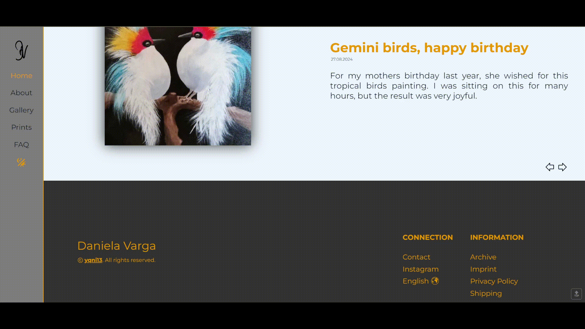
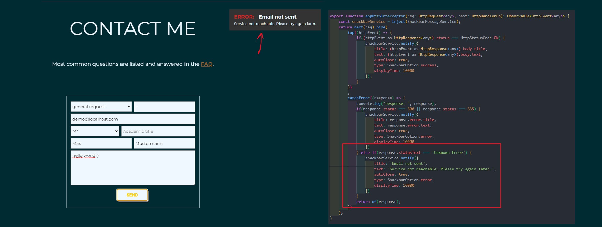
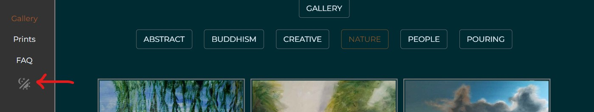
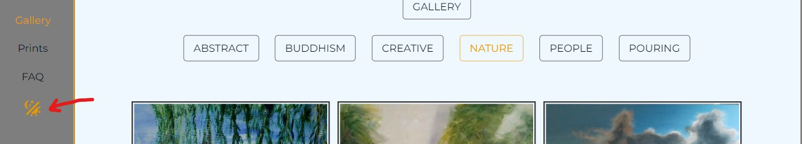
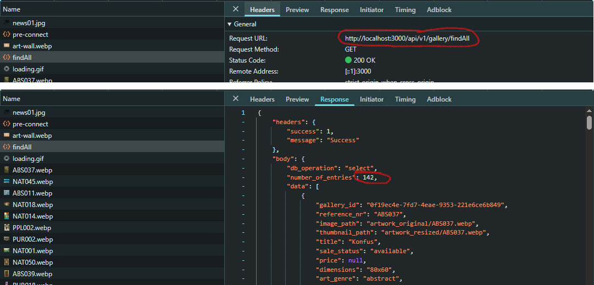
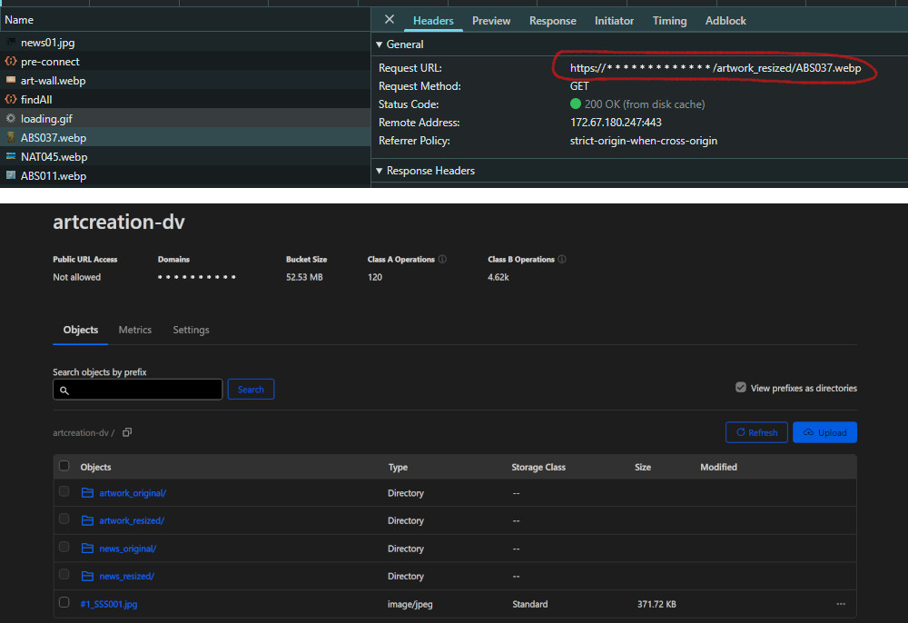
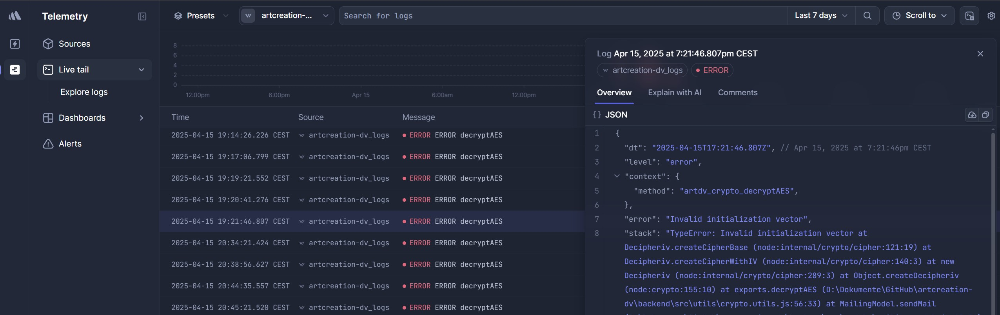

# yqni13 | $\texttt{\color{goldenrod}{ARTCREATION-DV}}$
### $\textsf{\color{brown}{v2.0.4}}$

<br><br>

<div>
      
</div>


<div align="center">
      <a href="https://v19.angular.dev/overview"></a>&nbsp;&nbsp;&nbsp;&nbsp;&nbsp;&nbsp;
      <a href="https://nodejs.org/en"></a>&nbsp;&nbsp;&nbsp;&nbsp;&nbsp;&nbsp;
      <a href="https://www.postgresql.org/"></a>&nbsp;&nbsp;&nbsp;&nbsp;&nbsp;&nbsp;
      <a href="https://neon.com/"></a>&nbsp;&nbsp;&nbsp;&nbsp;&nbsp;&nbsp;
      <a href="https://www.cloudflare.com/developer-platform/products/r2/"></a>&nbsp;&nbsp;&nbsp;&nbsp;&nbsp;&nbsp;
      <a href="https://rxjs.dev/"></a>&nbsp;&nbsp;&nbsp;&nbsp;&nbsp;&nbsp;
      <a href="https://expressjs.com/"></a>&nbsp;&nbsp;&nbsp;&nbsp;&nbsp;&nbsp;
      <a href="https://www.i18next.com/"></a>&nbsp;&nbsp;&nbsp;&nbsp;&nbsp;&nbsp;
      <a href="https://betterstack.com/"></a>&nbsp;&nbsp;&nbsp;&nbsp;&nbsp;&nbsp;
</div>
<br>

### $\textsf{\color{teal}Hosting}$
This project runs live (see link below). The frontend is hosted by <a href="https://app.netlify.com/">Netlify</a>, while the backend is hosted by <a href="https://vercel.com/">Vercel</a>.<br>
Data and images are managed via PostgreSQL database on <a href="https://neon.tech">Neon</a> and cloudstorage by <a href="https://cloudflare.com">Cloudflare</a>.
For testing purposes, one instance runs on env:stag, while the live version runs on env:prod.
### visit the <a href="https://artcreation-dv.at">WEBSITE</a>

<br>

## 🪄 $\textsf{\color{salmon}Getting started}$

### $\textsf{\color{teal}Prerequisites}$

- node: v20+
- Cloudstorage (R2 Object Storage)
- Betterstack Telemetry (logging)

<br>

### $\textsf{\color{teal}Local setup}$

Download or clone project

```sh
git clone https://github.com/yqni13/artcreation-dv
```

Create new .env file and fill in your credentials/other env data [(see docs)](./docs/CONFIGURATION.md).
<br>Navigate/cd into the root paths (/frontend and /backend) and install dependencies via npm:
```sh
$ npm ci
```

Additionally, the script to overwrite env data needs to be configured within `set-env.ts` (env:prod). Create a local copy [(see docs)](./docs/CONFIGURATION.md) for local development. Start application (frontend) in local environment:
```sh
$ npm run start
```
which will open automatically on `http://localhost:4200/`. To run backend, use:
```sh
$ node server.js
```

<br>

## 🧩 $\textsf{\color{salmon}Features}$

| Feature | Description |
|---------|-------------|
| 🪁 Angular | Angular v21 with nested routing |
| 📂 Cloud file handling | Upload/delete via Cloudflare R2 (S3-compatible) - supporting images up to 4MB |
| 🖼️ Preload | Customized image/video preload on page loading + viewport/scroll |
| ⌨ Input | Customized form components (text/textarea/select) |
| 🎠 Carousel | Customized carousel component |
| 🎨 Themes | Customized theme options (dark/light mode) |
| ⚠️ Validation | Customized validation in combination with Angular + Express-Validator |
| 📧 Email | Email service with node.js & nodemailer |
| 🗯️ Notification | Customized snackbar + extended translation service |
| 📱 Design | Responsive design 400px > width < 1800px supported via flexbox & media queries |

<br>

### $\textsf{\color{teal}Customized form}$

To contact the artist for product orders or general inquiries, a custom form is provided. Currently, this feature is not available in the live version due to the lack of backend hosting.
<br><br>
The form combines customized components, frontend/backend validation logic, `nodemailer`, and a Node.js service to send emails via a predefined no-reply account.

Validation checks ensure all required fields are filled, that the reference number follows the correct format, and that a valid selection has been made.<br>Figure 2 shows an example validation message:
`"ReferenceNr '561H65' does not exist"`.


<div align="center">
      
      Figure 2
</div>

<br>

### $\textsf{\color{teal}Internationalization}$

To reach an international audience of artists and art enthusiasts, the webpage was initially developed in English, with support for multiple languages implemented using the `ngx-translate` package (@ngx-translate/core + @ngx-translate/http-loader).
<br><br>
Currently, two languages are available: English and German (see Figure 3).
<br><br>
Static and dynamic texts are translated based on the selection made in the footer. The selected language is saved in `localstorage`, similar to the color theme, and persists between visits.
<br><br>
To simplify translation maintenance, the `TranslateHttpLoader` was customized to combine multiple `.json` files per language instead of the default single-file approach.
<br><br>

See [custom translate loader](frontend/public/assets/i18n/custom-translate-loader.ts) for implementation details.

<div align="center">
      
      Figure 3, v1.0.0-beta.4
</div>

<br>

### $\textsf{\color{teal}Customized snackbar / interceptor}$

In case of unexpected responses or to visually confirm actions, a custom snackbar appears at the top right (or centered on screens smaller than 500px). The snackbar can be triggered with just two required inputs (title + type), and optionally extended with up to five configuration parameters.
<br><br>
To enhance contrast, each of the four message types uses a distinct color: $\textsf{\color{red}{error}}$, $\textsf{\color{royalblue}{info}}$, $\textsf{\color{green}{success}}$, $\textsf{\color{orange}{warning}}$.

Figure 4 shows an example error message indicating that the email could not be sent (highlighted in red), triggered by an HTTP interceptor when no backend is available.

<div align="center">
      
      Figure 4
</div>

<br>

### $\textsf{\color{teal}Customized lazy loading / preload}$

Instead of Angular’s built-in `@defer` blocks, this application uses a custom lazy loading strategy via `host` properties.

When opening the Gallery component, all images currently within the viewport are rendered immediately. Additionally, a buffer of images just below the viewport is preloaded to ensure a smooth scrolling experience. As the user scrolls, more images are continuously preloaded.
<br><br>
Figure 5 illustrates how 6 images inside the viewport, along with the next 3 rows of images, are shown as preloaded in the network tab of DevTools.

<div align="center">
      
      Figure 5, v1.0.0-beta.3
</div>

<br>

### $\textsf{\color{teal}Theme settings}$

The webpage offers two theme settings: $\textsf{\color{gray}{dark mode}}$ & $\textsf{\color{goldenrod}{light mode}}$. The active setting is stored in the localstorage with dark mode as the default.

<div align="center">
      
      &nbsp;&nbsp;&nbsp;&nbsp;&nbsp;&nbsp;&nbsp;&nbsp;&nbsp;&nbsp;&nbsp;&nbsp;
      
      Figure 6
</div>

<br>

### $\textsf{\color{teal}Reactive images}$

Most images have additional logic attached for either displaying more details or scaling them up. In the news archive, additional text content is shown; clicking the magnifier icon displays the image in full resolution.
<br><br>
In the gallery section, preview thumbnails open in a museum-style view, showing all available details about the artwork. Clicking the image again displays it at maximum resolution (see Figure 7).

<div align="center">
      
      Figure 7
</div>

<br>

### $\textsf{\color{teal}Database layer}$

PostgreSQL is used as the relational database management system to store all necessary data. The free-tier plan from the Neon hosting service is sufficient to handle all data in this context (see Figure 8, basic findAll request).<br>Migrations are handled with the node package `node-pg-migrate` in the backend [(see docs)](/backend/src/db/migration.md)).
<br><br>
Image files for "gallery" and "news" elements are not stored in the database; only their paths are saved within the respective entries (see Figure 8, response). Additionally, files submitted by users (for "gallery" or "news" items) are processed (regarding format and size) and uploaded to a cloud object storage, in this case an R2 bucket from `Cloudflare`.
<br><br>
Once the data is retrieved from the database, the saved image path is concatenated with a cloud-specific access URL to form the full image URL (see Figure 9, red highlight). The images are then loaded from the cloud or cache.

<div align="center">
      
      Figure 8, v1.0.0-beta.13
</div>

<br>

<div align="center">
      
      Figure 9, v1.0.0-beta.13
</div>

<br>

### $\textsf{\color{teal}Administration}$

Data related to the "gallery" and "news" elements can be managed by the administrator via login and a dedicated administration area. While "gallery" data is accessible through the "gallery" section in the navigation bar, "news" items are displayed on the "home" page and in the archive. On the "home" page, the three latest "news" entries are presented using a carousel component.
<br><br>
The archive lists all "news" entries in descending chronological order. Features such as text-based search and sorting will be available in a future version.<br>

The application supports single-file uploads (maximum 4MB) from the user’s local device to associate an image with a newly created item. Alternatively, a "news" item can be linked to an existing "gallery" entry (see Figure 11: select an existing artwork). Using a foreign key referencing the linked "gallery" item's ID, a `LEFT JOIN` SQL query is used to retrieve the necessary and up-to-date data.
```sh
SELECT
  ${tableNews}.*,
  ${tableGallery}.image_path AS image_path_${tableGallery},
  ${tableGallery}.thumbnail_path AS thumbnail_path_${tableGallery},
  ${tableGallery}.reference_nr AS reference_nr_${tableGallery},
  ${tableGallery}.art_genre AS art_genre_${tableGallery}
FROM ${tableNews}
LEFT JOIN ${tableGallery} ON ${tableNews}.gallery = ${tableGallery}.gallery_id
ORDER BY ${orderPrio1} DESC
```
The provided image paths allow images to be loaded without additional database queries. The reference number and art genre offer sufficient information to navigate directly from a news article to the corresponding artwork details (see Figure 10).

<div align="center">
      
      Figure 10, v1.1.0
</div>

<br>

## 📝 $\textsf{\color{salmon}Logging}$

Currently, for the UI, only console logs and snackbar notifications inform users about errors and warnings. For the backend, the logging framework `Winston` is used in combination with Logtail from `BetterStack` for easy access and long-term storage (see Figure 11, test phase).

<div align="center">
      
      Figure 11, v1.0.2
</div>

<br>

## 🔧 $\textsf{\color{salmon}Testing}$

### $\textsf{\color{teal}Jest}$

The `jest` testing framework was added to the project, providing unit-tests and integration-tests for the backend.<br>
Install the packages `@jest/globals`, `@types/jest` and `supertest` in addition to `jest`:
```sh
npm install jest @jest/globals @types/jest supertest --save-dev
```
Only some basic tests exist currently for utils [(see tests)](./backend/tests).<br>
Run tests on local device by including setup for dotenv/config to provide environment variables:
```sh
set MODE=staging && jest --setupFiles dotenv/config
```
or simply save as script command in `package.json` to run `npm test`:
```sh
  "scripts": {
    "start": "node server.js",
    "test": "set MODE=staging && jest --setupFiles dotenv/config"
  }
```
To automatically run tests before merging a feature/development branch upstream, a `GitHub Action` is set up [(see main.yml)](.github/workflows/main.yml).<br>
To prevent an unwanted merge due to an unfinished or failed test run, the project is set up to disable merging until all tests have passed (see Figure 12).

<div align="center">
    
    Figure 12, v1.2.7
</div>


### $\textsf{\color{teal}Cross-browser testing}$

 |  |  |  |  | 
|:------:|:------:|:------:|:------:|:------:|:------:|
|Firefox | Chrome | Opera  | Edge   | DuckGo | Brave  |
|Yes*    | Yes    | Yes    | Yes    | Yes    | Yes    |


<br>

*This browser has problems with some functionality.

<br>

### $\textsf{\color{teal}Angular ESLint}$

Angular ESLint was added to the project as the next step of testing.<br>
Install ESLint global via node package manager: 
```sh 
$ npm install -g eslint
```
Install ESLint local for angular project: 

```sh
$ ng add @angular-eslint/schematics
```

Run ESLint to list all current lint errors: 
```sh
$ npm run lint
```
<br>


## 📈 $\textsf{\color{salmon}Updates}$
[see changelog for all updates](./docs/CHANGELOG.md)

### $\textsf{\color{forestgreen}last update:}$

$\textsf{[v2.0.2\ =>\ {\textbf{\color{brown}v2.0.4}]}}$ app
- $\textsf{\color{orange}Patch:}$ Updated:
  + frontend on eslint rules & guidelines
  + small refactoring and fixes

<br>

### Aimed objectives for next $\textsf{\color{green}minor}$ update:
<dl>
      <dd>- pagination in archive component</dd>
      <dd>- provide security standards: input sanitizations, content security policies & HttpOnly cookies</dd>
      <dd>- deploy a Web Application Manifest to make webpage into a progressive web app (PWA)</dd>
</dl>
<br>

### Aimed objectives for next $\textsf{\color{cyan}major}$ update:
<dl>
      <dd>- direct pay option</dd>
</dl>
<br>
